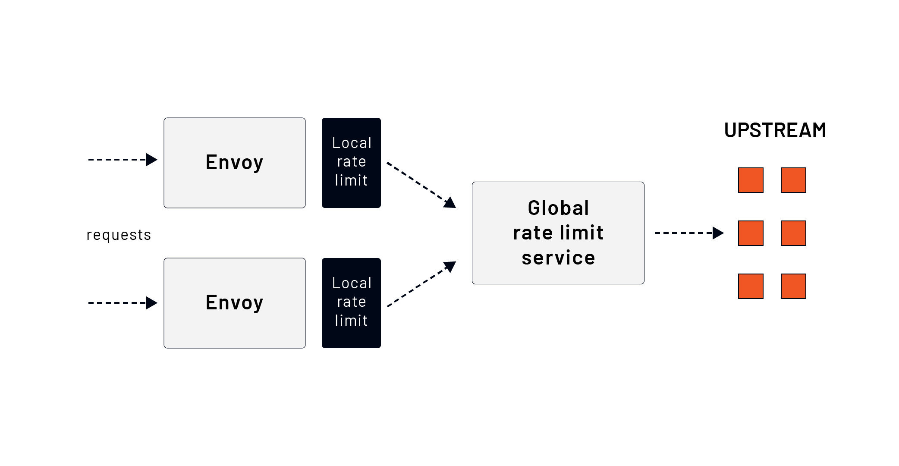

# 速率限制简介

速率限制是一种限制传入请求的策略。它规定了一个主机或客户端在一个特定的时间范围内发送多少次请求。一旦达到限制，例如每秒 100 个请求，我们就说发送请求的客户端受到速率限制。任何速率受限的请求都会被拒绝，并且永远不会到达上游服务。稍后，我们还将讨论可以使用的断路器，以及速率限制如何限制上游的负载并防止级联故障。

Envoy 支持全局（分布式）和局部（非分布式）的速率限制。

全局和局部速率限制的区别在于，我们要用全局速率限制来控制对一组在多个 Envoy 实例之间**共享的**上游的访问。例如，我们想对一个叫做多个 Envoy 代理的数据库的访问进行速率限制。另一方面，局部速率限制适用于每一个 Envoy 实例。

局部和全局速率限制可以一起使用，Envoy 分两个阶段应用它们。首先，应用局部速率限制，然后是全局速率限制。

我们将在接下来的章节中深入研究全局和局部速率限制，并解释这两种情况如何工作。