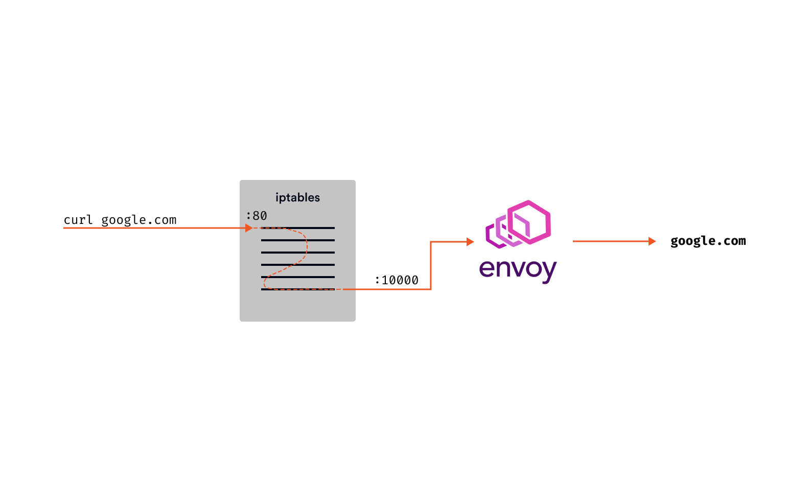

# 实验 9：原始目的地过滤器

在这个实验中，我们将学习如何配置原始目的地过滤器。要做到这一点，我们需要启用 IP 转发，然后更新 iptables 规则，以捕获所有流量并将其重定向到 Envoy 正在监听的端口。

我们将使用一个 Linux 虚拟机，而不是 Google Cloud Shell。

让我们从启用 IP 转发开始。

```sh
# 启用IP转发功能
sudo sysctl -w net.ipv4.ip_forward=1
```

接下来，我们需要配置 iptables 来捕获所有发送到 80 端口的流量，并将其重定向到 10000 端口。Envoy 代理将在 10000 端口进行监听。

首先，我们需要确定我们将在 iptables 命令中使用的网络接口名称。我们可以使用 `ip link show` 命令列出网络接口。例如：

```sh
jimmy@instance-1:~$ ip link show
1: lo: < LOOPBACK,UP,LOWER_UP> mtu 65536 qdisc noqueue state UNKNOWN mode DEFAULT group default qlen 1000 link/loopback 00:00:00:00:00:00 brd 00:00:00:00:00
2: ens4: < BROADCAST,MULTICAST,UP,LOWER_UP> mtu 1460 qdisc mq state UP mode DEFAULT group default qlen 1000 link/ether 42:01:0a:8a:00:2e brd ff:ff:ff:ff:ff:ff
```

输出结果告诉我们，我们有两个网络接口：环回接口和一个名为 `ens4` 的接口。这是我们将在 iptables 命令中使用的接口名称。

```sh
# 捕获所有来自外部的80端口的流量并将其重定向到10000端口
sudo iptables -t nat -A PREROUTING -i ens4 -p tcp --dport 80 -j REDIRECT --to port 10000
```

最后，我们将运行另一条 iptables to 命令，防止从虚拟机发出请求时出现路由循环。设置这个规则将允许我们从虚拟机上运行 `curl tetrate.io`，并且仍然被重定向到 10000 端口。

```sh
# 使我们能够从同一个实例中运行curl（即防止路由循环）。
sudo iptables -t nat -A OUTPUT -p tcp -m owner !--uid-owner root --dport 80 --j REDIRECT --to port 10000
```

在修改了 iptables 规则后，我们可以创建以下 Envoy 配置。

```yaml
static_resources:
  listeners:
    - name: inbound
      address:
        socket_address:
          address: 0.0.0.0
          port_value: 10000
      listener_filters:
        - name: envoy.filters.listener.original_dst
          typed_config:
            "@type": type.googleapis.com/envoy.extensions.filters.listener.original_dst.v3.OriginalDst
      filter_chains:
        - filters:
          - name: envoy.filters.network.http_connection_manager
            typed_config:
              "@type": type.googleapis.com/envoy.extensions.filters.network.http_connection_manager.v3.HttpConnectionManager
              stat_prefix: ingress_http
              access_log:
              - name: envoy.access_loggers.file
                typed_config:
                  "@type": type.googleapis.com/envoy.extensions.access_loggers.file.v3.FileAccessLog
                  path: ./envoy.log
              http_filters:
              - name: envoy.filters.http.router
              route_config:
                virtual_hosts:
                - name: proxy
                  domains: ["*"]
                  routes:
                  - match:
                      prefix: "/"
                    route:
                      cluster: original_dst_cluster
  clusters:
    - name: original_dst_cluster
      type: ORIGINAL_DST
      connect_timeout: 5s
      lb_policy: CLUSTER_PROVIDED
      original_dst_lb_config:
        use_http_header: true
```

这个配置看起来与我们已经看到的配置相似。我们在 `listenener_filters` 中添加了 `original_dst` 过滤器，启用了对一个文件的访问日志，并将所有流量路由到一个叫做 `original_dst_cluster` 的集群。这个集群的类型设置为 `ORIGINAL_DST`，将请求发送到原始目的地。

此外，我们将 `use_http_header` 字段设置为 true。当设置为 true 时，我们可以使用 `x-envoy-original-dst-host` 头来覆盖目标地址。请注意，这个标头默认情况下是**没有**经过处理的，所以启用它允许将流量路由到任意的主机，这可能会产生安全问题。我们在这里只是把它作为一个例子。



对于透明代理的情况，这就是我们所需要的。我们不希望做任何解析。我们希望将请求代理到原始目的地。

将上述 YAML 保存为 `5-lab-1-originaldst.yaml`。

为了运行它，我们将使用 [func-e CLI](https://func-e.io/)。让我们在虚拟机上安装 CLI。

```sh
curl https://func-e.io/install.sh | sudo bash -s -- -b /usr/local/bin
```

现在我们可以用我们创建的配置运行 Envoy 代理。

```sh
sudo func-e run -c 5-lab-1-originaldst.yaml
```

> 注意，在这种情况下，我们用 `sudo` 运行 `func-e`，所以我们可以用同一台机器来测试代理，防止路由循环（见第二条 iptables 规则）。

我们可以向 `tetrate.io` 发送一个请求，如果我们查看 `envoy.log` 文件，我们会看到以下条目。

```
[2021-07-07T21:22:57.294Z] "GET / HTTP/1.1" 301 - 0 227 34 34 "-" "curl/7.64.0" "5fd04969-27b0-4d37-b56c-c273a410da46" "tedrate.io" "75.119.195.116:80"
```

日志条目显示，iptables 捕获了该请求，并将其重定向到 Envoy 正在监听的端口 `10000` 。然后，Envoy 将该请求代理到原来的目的地。

我们也可以从虚拟机的外部提出请求。从第二个终端：这一次，我们使用 Google Cloud Shell，而且我们不在虚拟机中。我们可以向虚拟机的 IP 地址发送请求，并提供 `x-envoy-original-dst-host` 头，我们希望 Envoy 将请求发送给该 IP 地址。

> 我在这个例子中使用 `google.com`。要获得 IP 地址，你可以运行 `nslookup google.com` 并使用该命令中的 IP 地址。

```sh
$ curl -H "x-envoy-original-dst-host: 74.125.199.139" [vm-ip-address]
<HTML><HEAD><meta http-equiv="content-type" content="text/html;charset=utf-8">
<TITLE>301 Moved</TITLE></HEAD><BODY>
<H1>301 Moved</H1>
The document has moved
<A HREF="http://www.google.com/">here</A>.
</BODY></HTML>
```

你会注意到响应被代理到了 `google.com`。我们也可以检查虚拟机上的 `envoy.log` 来查看日志条目。

要清理 iptables 规则并禁用 IP 转发，请运行：

```sh
# 禁用IP转发功能
sudo sysctl -w net.ipv4.ip_forward=0

# 从nat表中删除所有规则
sudo iptables -t nat -F
```
