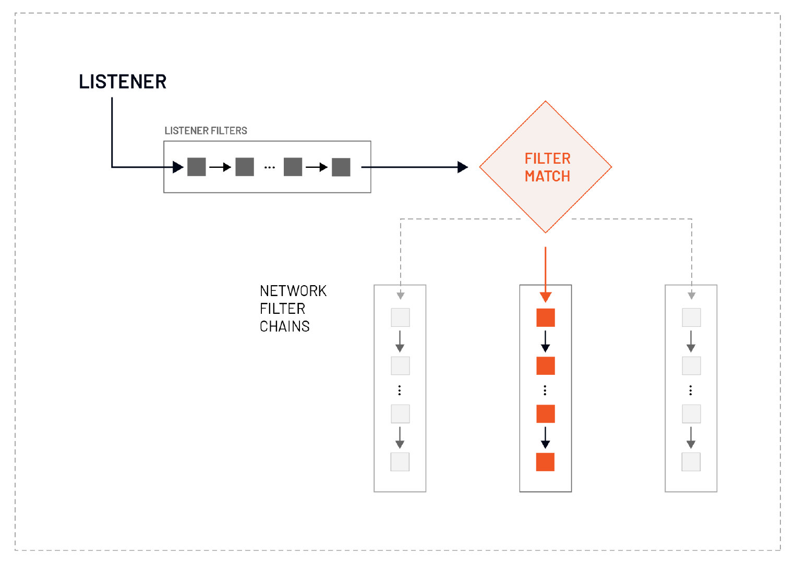

# 监听器过滤器

正如在介绍章节中提到的，**监听器子系统**处理**下游**或传入的请求处理。监听器子系统负责传入的请求和对客户端的响应路径。除了定义 Envoy 对传入请求进行 "监听" 的地址和端口外，我们还可以选择对每个监听器进行监听**过滤器的**配置。

不要把监听器过滤器和我们前面讨论的网络过滤器链和 L3/L4 过滤器混淆起来。Envoy 在处理网络级过滤器之前先处理监听器过滤器，如下图所示。

请注意，在没有任何监听器过滤器的情况下操作 Envoy 也是常见的。

Envoy 会在网络级过滤器之前处理监听器过滤器。我们可以在监听器过滤器中操作连接元数据，通常是为了影响后来的过滤器或集群如何处理连接。

监听器过滤器对新接受的套接字进行操作，并可以停止或随后继续执行进一步的过滤器。监听器过滤器的顺序很重要，因为 Envoy 在监听器接受套接字后，在创建连接前，会按顺序处理这些过滤器。

我们可以使用监听器过滤器的结果来进行过滤器匹配，并选择一个合适的网络过滤器链。例如，我们可以使用 HTTP 检查器监听器过滤器来确定 HTTP 协议（HTTP/1.1 或 HTTP/2）。基于这个结果，我们就可以选择并运行不同的网络过滤器链。